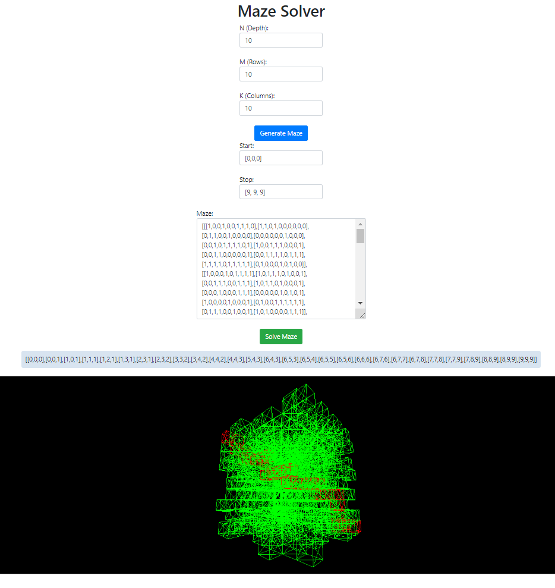

# 3D Maze Solver

This application generates and solves 3D mazes. Users can specify the dimensions of the maze as well as the start and stop positions. The solution illustrates the path through the maze with interactive 3D graphics.

## Features

- Generate a random 3D maze with customizable dimensions.
- Solve the maze and visualize the solution path in 3D.

## Install Dependencies
```bash
pip install flask
```

## Run the Application
```bash
python app.py
```

Open a web browser and navigate to http://127.0.0.1:5000/

